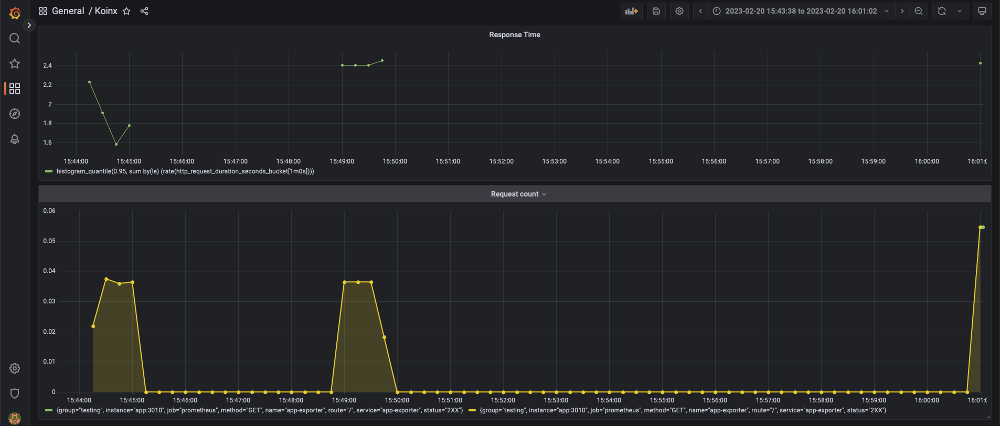

# A Server Side Application to fetch Crypto Transactions of a user and monitor the server

To run the application, you will need to create an .env file in the root directory of the project and add the following variables:

```
ETHERSCAN_APIKEY=
```

The API key can be obtained from [Etherscan](https://etherscan.io/apis).

After that, run the following commands:

```
docker-compose up
```

to start the server and send the requests to

```
http://localhost:3010/?address=0xce94e5621a5f7068253c42558c147480f38b5e0d
```

to get the transactions of the user.

The docker compose file includes:

- Portainer to monitor the containers, at port 9000
- MongoDB to store the transactions, at port 27017
- Mongo Express to monitor the database, at port 8080
- NodeJS to run the server, at port 3010
- Prometheus to scrape the metrics, at port 9090
- Grafana to visualize the metrics, at port 3000

The metrics are scraped by Prometheus every 5 seconds and visualized in Grafana.

## Screenshots

### Portainer


### Mongo Express


### Grafana



### Prometheus


### Calling the API through Postman


